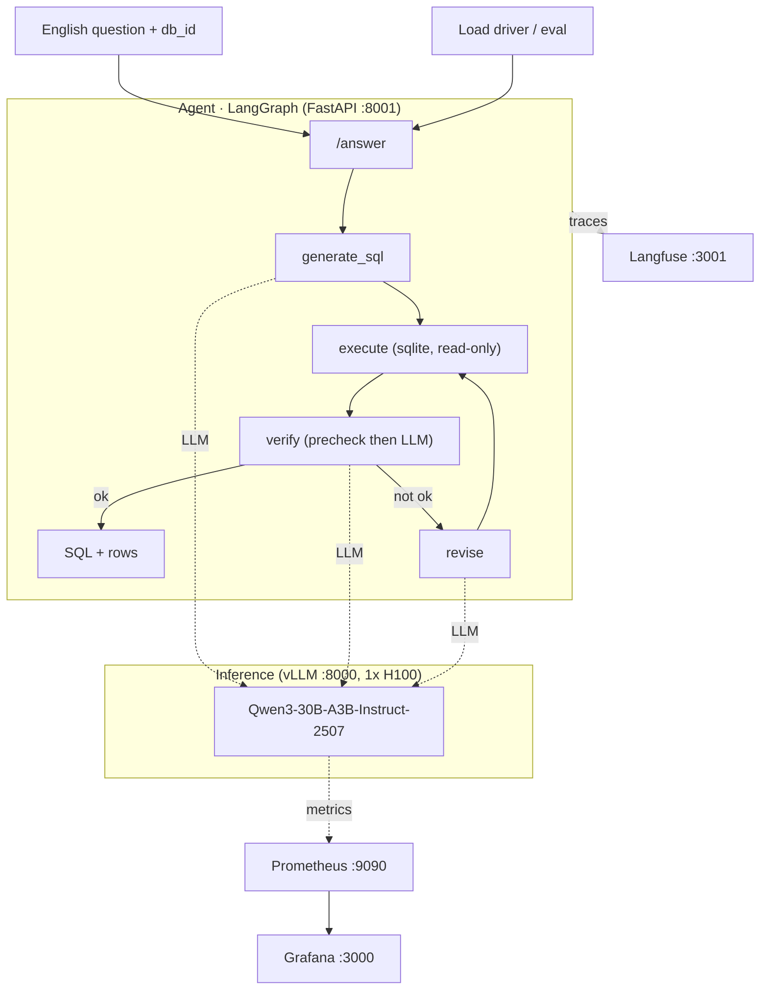

# Text-to-SQL on an H100: production-grade LLM inference and observability

A compact, reproducible reference implementation of a text-to-SQL system built the
way you would actually run one in production. An open-weights MoE model served on a
single GPU, a multi-step agent on top, a full observability stack, and then a
load test against a latency SLO followed by a documented, metric-grounded tuning
investigation.

The headline is not the green checkmark, it is the diagnosis trail: how a serving
dashboard that looked perfectly healthy hid the real bottleneck, and how reading
the right metric at each step took end-to-end p95 latency from **83s to 5.3s
(16x)** without losing answer quality.

> **Scenario.** Analysts ask questions in English. The system writes SQL, runs it
> against a warehouse, and returns rows. Model: [`Qwen3-30B-A3B-Instruct-2507`](https://huggingface.co/Qwen/Qwen3-30B-A3B-Instruct-2507)
> (30B MoE, 3.3B active). Data and evaluation: [BIRD-bench](https://bird-bench.github.io/).
> Hardware: 1x H100 80GB.

---

## What this repo demonstrates

- **Inference serving.** Deploying an open-weights MoE with **vLLM** and choosing
  config flags for a specific workload (prompt shape, output length, latency
  target) rather than defaults.
- **Observability that reads cold.** A **Grafana/Prometheus** dashboard built from
  vLLM's `/metrics` covering latency percentiles, throughput, and KV-cache
  headroom, plus **Langfuse** agent tracing with filterable metadata.
- **Agent design that adds measurable value.** A **LangGraph** generate, execute,
  verify, revise loop, with the loop's contribution quantified via per-iteration
  evaluation rather than assumed.
- **Rigorous evaluation.** Execution-accuracy scoring (canonicalized row sets) and
  a per-iteration pass-rate analysis that tells you whether the agent architecture
  is earning its cost.
- **SLO engineering.** Load testing to a target (`p95 < 5s at >=10 RPS over 5 min`),
  then a metric-grounded loop of diagnose, change one thing, re-measure.
- **Reproducibility.** One `.env` switch moves the agent between a hosted
  OpenAI-compatible endpoint (for cheap off-GPU development) and your own vLLM on
  the H100. A mock `/metrics` exporter lets you validate the dashboard with no GPU
  at all.

---

## Results

Real numbers from the 30B model on one H100. Full writeup in **[`REPORT.md`](REPORT.md)**.

**Execution accuracy** (30 BIRD questions, rows compared after canonicalization):

| | overall | iter 0 | iter 1 | iter 2 |
|---|---|---|---|---|
| baseline | 40.0% | 36.7% | 40.0% | 40.0% |
| final config | 43.3% | 40.0% | 43.3% | n/a |

The verify, revise loop lifts pass rate by one question at the first revise and
nothing after, so the final config caps the loop at 2 and replaces the always-on
LLM verifier with a deterministic pre-check (details below).

**SLO investigation** (`p95 end-to-end agent latency < 5s at 10 RPS over 5 min`):

| stage | change | p95 | errors |
|---|---|---|---|
| baseline | single-process agent | **83.4s** | 12.6% |
| iter 1 | agent server to 4 workers | 10.0s | 0 |
| iter 2 | fix a schema-rendering crash | 10.0s | **0%** |
| iter 3 | verify pre-check plus cap loop at 2 | **5.28s** | 0 |

**Verdict: narrowly missed, reported honestly.** p95 of 5.28s is about 5% over the
5s target across the required 5-minute window, but it is a **16x improvement** with
**0 errors** and p50 at 1.5s. The interesting part is why each number moved, below.

### The diagnosis that matters

The baseline missed the SLO by 16x, yet the vLLM dashboard looked healthy:
`queue = 0`, KV cache around 15%, no preemptions. The contradiction was the clue,
the bottleneck was not the model server at all. Three findings, each grounded in a
metric, none of them a vLLM serving knob:

1. **A green dashboard hiding an agent-layer bottleneck.** The agent's request
   handler was synchronous (blocking `graph.invoke` in a fixed thread pool). At
   load, full agent runs queued inside the agent process while vLLM sat idle.
   Scaling the agent's concurrency cut p95 by 8x.
2. **A deterministic bug masquerading as load failures.** A stubborn 12.6% error
   rate was identical across runs, so it was not load-related. Instrumenting the
   actual exception (after ruling out context-length and missing-DB hypotheses by
   direct measurement) revealed a crash in the provided schema renderer on foreign
   keys whose target column is `NULL`, present in 2 of 11 BIRD databases. A
   happy-path eval never touched those DBs. The load test surfaced it.
3. **A structural latency tax.** With serving healthy, run latency was dominated by
   the number of sequential LLM calls per request. Since the loop's only useful
   catch (duplicate rows) is programmatically detectable, the always-on LLM
   verifier was replaced by a cheap pre-check that escalates to the model only for
   ambiguous cases. That halved LLM calls per run and pulled p95 to the SLO
   boundary at no quality cost.

---

## Architecture



**The agent** converts a question to SQL, runs it read-only against the target
sqlite DB, verifies the result is plausible, and revises if not, capped at 2
iterations. `verify` first applies a deterministic pre-check (SQL error means fail,
clean non-empty result means pass, zero-rows or duplicate-bloat escalate to the
LLM), so most runs make a single model call.

**The serving layer** is vLLM exposing an OpenAI-compatible API and a Prometheus
`/metrics` endpoint. The agent is just an HTTP client of that API, which is what
makes the backend swappable (see Reproducibility).

---

## Repository layout

```
agent/
  graph.py        LangGraph agent: generate, execute, verify (precheck+LLM), revise
  prompts.py      Prompt templates (SQLite-aware, JSON verdicts)
  config.py       Backend resolver, one .env switch picks the LLM endpoint
  server.py       FastAPI /answer wrapper + Langfuse callback
  execution.py    Read-only SQL execution (provided)
  schema.py       Schema rendering (provided, NULL-FK crash fixed here)
evals/
  run_eval.py     Execution-accuracy eval + per-iteration pass-rate analysis
load_test/
  driver.py       Async load generator (provided)
infra/
  grafana/.../serving.json   Dashboard: latency pctiles, throughput, KV cache
  prometheus.yml             Scrape config
scripts/
  start_vllm.sh              vLLM launch with reasoned, workload-specific flags
  mock_vllm_metrics.py       Fake /metrics exporter for off-GPU dashboard dev
  check_env.sh               Pre-flight: driver, uv, docker, disk, ports
  load_data.py               BIRD subset downloader (provided)
docker-compose.yml           Prometheus + Grafana + Langfuse stack
REPORT.md                    Engineering writeup: config, eval, SLO investigation
DECISIONS.md                 Engineering decision record + the diagnosis trail
RUNBOOK.md                   Step-by-step local/dev workflow
H100_PLAYBOOK.md             Fail-fast GPU-session run sheet
```

---

## Reproducing the results

The design separates building from measuring. Develop and validate the entire
pipeline off-GPU against any OpenAI-compatible endpoint, then point it at your own
vLLM on an H100 only when the numbers need to be real. The backend is chosen by a
single `LLM_BACKEND` variable in `.env` (`nebius`, `openai`, `cpu`, or `h100`).

**1. Local development (no GPU).** Bring up the observability stack, develop the
agent and eval against a hosted endpoint, and validate the dashboard with the mock
metrics exporter. Full steps in **[`RUNBOOK.md`](RUNBOOK.md)**:

```bash
cp .env.example .env          # set LLM_BACKEND + your API key
uv sync
docker compose up -d          # Prometheus :9090, Grafana :3000, Langfuse :3001
uv run python scripts/load_data.py
uv run uvicorn agent.server:app --host 0.0.0.0 --port 8001   # the agent
uv run python scripts/mock_vllm_metrics.py                   # makes the dashboard react, no GPU
```

**2. The real run (1x H100).** Serve the 30B with vLLM, then re-run the eval and
the load test for numbers that count. Fail-fast, copy-paste run sheet in
**[`H100_PLAYBOOK.md`](H100_PLAYBOOK.md)**:

```bash
bash scripts/check_env.sh     # what the GPU box has vs needs
# .env: LLM_BACKEND=h100, HF_TOKEN=...
bash scripts/start_vllm.sh    # workload-tuned flags
uv run python evals/run_eval.py --out results/eval_baseline.json
uv run python load_test/driver.py --rps 10 --duration 300
```

No agent, eval, or dashboard code changes between the two, only the `.env` backend.

---

## Tech stack

`vLLM` (serving), `LangGraph` + `LangChain` (agent), `Langfuse` (tracing),
`Prometheus` + `Grafana` (metrics), `FastAPI` (agent API), `uv` (environment),
`BIRD-bench` (data and eval), `Qwen3-30B-A3B-Instruct-2507`.

## Limitations and next steps

- **The last 5% of the SLO** is p99-tail work (a few runs still make 2 calls plus a
  slow generation). Request hedging or a per-call timeout-retry would clip it.
- **Async the agent** (`graph.ainvoke`) rather than scaling processes, for cleaner
  concurrency than a thread pool.
- **Richer eval.** An LLM-as-judge dimension beyond execution accuracy, and a
  production-to-research loop that folds Langfuse-captured failures back into the
  eval set.
- **Schema retrieval.** Pass only question-relevant tables to shrink prefill.

## Acknowledgements

Built as a hands-on study of production LLM inference and observability. Uses
[BIRD-bench](https://bird-bench.github.io/) for databases and evaluation, and the
open-source vLLM, LangGraph, Langfuse, and Grafana stack. The schema renderer, SQL
execution, graph scaffolding, and load driver began as a starter template. The
serving config, agent logic, prompts, dashboard, evaluation, and the entire SLO
investigation are the contribution here.

## License

MIT. See `LICENSE`.
